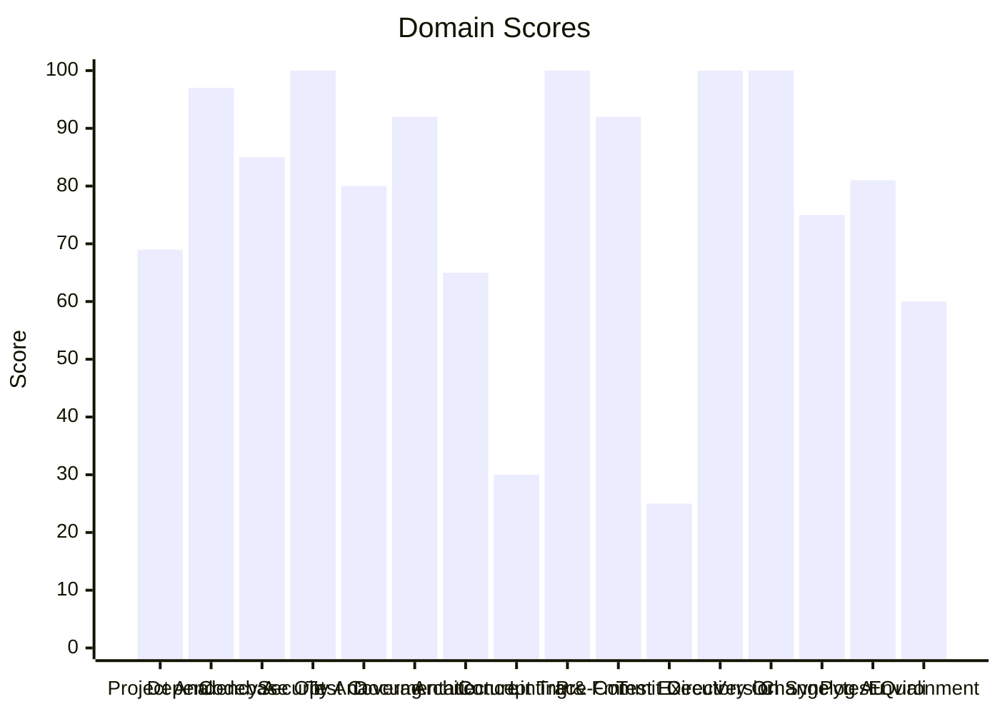

# 🔬 Code Enhancement Report

> **Generated**: 2026-05-22 21:09:49 UTC | **Target**: listmonk-api | **Overall GPA**: 2.62/4.0

---

## 📊 Executive Summary

| Domain | Grade | Score | Status |
|--------|-------|-------|--------|
| Test Execution | 🔴 F | 25/100 | `█████░░░░░░░░░░░░░░░` 25/100 |
| Concept Traceability | 🔴 F | 30/100 | `██████░░░░░░░░░░░░░░` 30/100 |
| Environment Variables | 🟠 D | 60/100 | `████████████░░░░░░░░` 60/100 |
| Architecture & Design Patterns | 🟠 D | 65/100 | `█████████████░░░░░░░` 65/100 |
| Project Analysis | 🟠 D | 69/100 | `█████████████░░░░░░░` 69/100 |
| Changelog Audit | 🟡 C | 75/100 | `███████████████░░░░░` 75/100 |
| Test Coverage | 🔵 B | 80/100 | `████████████████░░░░` 80/100 |
| Pytest Quality | 🔵 B | 81/100 | `████████████████░░░░` 81/100 |
| Codebase Optimization | 🔵 B | 85/100 | `█████████████████░░░` 85/100 |
| Documentation & Governance | 🟢 A | 92/100 | `██████████████████░░` 92/100 |
| Pre-Commit Compliance | 🟢 A | 92/100 | `██████████████████░░` 92/100 |
| Dependency Audit | 🟢 A | 97/100 | `███████████████████░` 97/100 |
| Security Analysis | 🟢 A | 100/100 | `████████████████████` 100/100 |
| Linting & Formatting | 🟢 A | 100/100 | `████████████████████` 100/100 |
| Directory Organization | 🟢 A | 100/100 | `████████████████████` 100/100 |
| Version Sync Analysis | 🟢 A | 100/100 | `████████████████████` 100/100 |

---

## 📋 Domain Scorecards

### Project Analysis — 🟠 Grade: D (69/100)

`█████████████░░░░░░░` 69/100

> [!WARNING]
> Detected ecosystem marker: agent-utilities → Agent-Utilities Ecosystem

| Criterion | Points | Evidence | Reasoning |
|-----------|--------|----------|-----------|
| has_pyproject | 10 | `pyproject.toml and requirements.txt` | Both pyproject.toml and requirements.txt exist, fulfilling mandatory Python proj |
| project_type_detected | 10 | `Agent-Utilities Ecosystem` | Identified 1 ecosystem marker(s) in dependencies |
| externalized_prompts | 0 | `/home/apps/workspace/agent-packages/agents/listmonk-api` | No prompts/ directory found. Prompts may be hardcoded in source. |
| observability | 0 | `dependency list` | No observability tools (logfire, sentry, opentelemetry) found |
| testing_suite | 5 | `tests dir: True, pytest dep: False` | Tests directory exists, pytest not in dependencies |
| agents_md | 10 | `/home/apps/workspace/agent-packages/agents/listmonk-api/AGEN` | AGENTS.md exists with comprehensive content |
| pre_commit_hooks | 10 | `/home/apps/workspace/agent-packages/agents/listmonk-api/.pre` | Pre-commit configuration found for automated code quality checks |
| gitignore | 10 | `/home/apps/workspace/agent-packages/agents/listmonk-api/.git` | .gitignore exists to prevent committing build artifacts and secrets |
| env_template | 10 | `/home/apps/workspace/agent-packages/agents/listmonk-api/.env` | Environment template exists for onboarding and secret management |
| protocol_support | 4 | `MCP` | 1 communication protocol(s) detected |

**Findings:**
- Protocol support: MCP

---

### Dependency Audit — 🟢 Grade: A (97/100)

`███████████████████░` 97/100

> [!TIP]
> Minor update: agent-utilities 0.2.40 (installed) -> 0.16.0

| Criterion | Points | Evidence | Reasoning |
|-----------|--------|----------|-----------|
| dependency_freshness | 97 | `source=/home/apps/workspace/agent-packages/agents/listmonk-a` | Audited 1 deps (1 installed, 0 constraint-only). 0 major, 1 minor, 0 patch updates |

---

### Codebase Optimization — 🔵 Grade: B (85/100)

`█████████████████░░░` 85/100

> [!NOTE]
> Monolithic: listmonk_api.py (734L) — 2 functions with high complexity (worst: Api.create_campaign at 64L, CC=23); God class: Api (29 methods) — consider mixins/composition

| Criterion | Points | Evidence | Reasoning |
|-----------|--------|----------|-----------|
| code_quality | 85 | `{"file_count": 21, "total_lines": 2818, "function_count": 13` | Analyzed 21 files, 130 functions. Avg CC=4.8, max length=107, duplication=0.5%,  |

---

### Security Analysis — 🟢 Grade: A (100/100)

`████████████████████` 100/100

| Criterion | Points | Evidence | Reasoning |
|-----------|--------|----------|-----------|
| security_posture | 100 | `high=0 med=0 low=0 attack_surface={"subprocess_calls": 0, "f` | Scanned 21 files. Found 0 security findings. High: -0pts, Med: -0pts, Low: -0pts |

---

### Test Coverage — 🔵 Grade: B (80/100)

`████████████████░░░░` 80/100

> [!NOTE]
> Test suite lacks intent diversity (only one type)

| Criterion | Points | Evidence | Reasoning |
|-----------|--------|----------|-----------|
| test_coverage_quality | 80 | `{"test_file_count": 4, "test_count": 36, "source_file_count"` | 36 tests across 4 files. Ratio: 1.71. Intent: {'unit': 36}. 0 without assertions |

**Findings:**
- 12 potential doc-test drift items

---

### Documentation & Governance — 🟢 Grade: A (92/100)

`██████████████████░░` 92/100

> [!TIP]
> README.md missing sections: usage|quick start

| Criterion | Points | Evidence | Reasoning |
|-----------|--------|----------|-----------|
| documentation_quality | 92 | `{"README.md": {"exists": true, "missing": ["usage|quick star` | Audited 6 standard docs + docs/ directory. 0 broken references, 4 docs present.  |

**Findings:**
- 2 broken internal links in README.md
- README missing: Has a Table of Contents
- README missing: Has usage examples with code blocks

---

### Architecture & Design Patterns — 🟠 Grade: D (65/100)

`█████████████░░░░░░░` 65/100

> [!WARNING]
> SRP: 1 modules exceed 500 lines (god modules)

| Criterion | Points | Evidence | Reasoning |
|-----------|--------|----------|-----------|
| architecture_quality | 65 | `{"layers": 0, "di_ratio": 0.05, "solid_violations": 2}` | Analyzed 21 files. 0/5 architecture layers present, DI ratio: 5%, 2 SOLID violat |

**Findings:**
- SRP: 1 classes have >15 methods
- No discernible layer architecture (no domain/service/adapter separation)
- Low dependency injection ratio: 5%

---

### Concept Traceability — 🔴 Grade: F (30/100)

`██████░░░░░░░░░░░░░░` 30/100

> [!CAUTION]
> Low traceability ratio: 0% concepts fully traced

| Criterion | Points | Evidence | Reasoning |
|-----------|--------|----------|-----------|
| concept_traceability | 30 | `{"total_concepts": 5, "well_traced": 0, "orphans": 5, "drift` | 5 unique concepts found. 0 fully traced (code+docs+tests), 5 orphans, 0 drifted. |

**Findings:**
- 36 test functions missing concept markers
- 51 significant functions (>10 lines) missing concept markers in docstrings

---

### Linting & Formatting — 🟢 Grade: A (100/100)

`████████████████████` 100/100

> [!TIP]
> Total lint findings: 0 (high/error: 0, medium/warning: 0, low: 0)

| Criterion | Points | Evidence | Reasoning |
|-----------|--------|----------|-----------|
| lint_compliance | 100 | `ruff=0, bandit=0, mypy=0` | 0 total findings across 3 tools. High/error: -0pts, Med/warning: -0pts, Low: -0p |

---

### Pre-Commit Compliance — 🟢 Grade: A (92/100)

`██████████████████░░` 92/100

> [!TIP]
> 1/14 pre-commit hooks failed: don't commit to branch

| Criterion | Points | Evidence | Reasoning |
|-----------|--------|----------|-----------|
| precommit_compliance | 92 | `{"total_hooks": 14, "passed": 13, "failed": 1, "skipped": 0,` | Ran pre-commit with 14 hooks: 13 passed, 1 failed, 0 skipped. 1 potentially outd |

**Findings:**
- 1 hook(s) may be outdated: ruff-pre-commit

---

### Test Execution — 🔴 Grade: F (25/100)

`█████░░░░░░░░░░░░░░░` 25/100

> [!CAUTION]
> No tests were executed (test framework detected but no tests found)

| Criterion | Points | Evidence | Reasoning |
|-----------|--------|----------|-----------|
| test_execution | 25 | `{"frameworks_detected": 1, "total_passed": 0, "total_failed"` | Executed 1 framework(s). 0 passed, 0 failed, 0 errors. Pass rate: 0%. |

---

### Directory Organization — 🟢 Grade: A (100/100)

`████████████████████` 100/100

| Criterion | Points | Evidence | Reasoning |
|-----------|--------|----------|-----------|
| directory_organization | 100 | `{"total_source_files": 39, "total_directories": 8, "max_dept` | 39 files across 8 directories. Max depth: 2, avg files/dir: 4.9. 0 crowded, 0 se |

---

### Version Sync Analysis — 🟢 Grade: A (100/100)

`████████████████████` 100/100

> [!TIP]
> All version '0.6.0' declarations appear to be tracked correctly.

| Criterion | Points | Evidence | Reasoning |
|-----------|--------|----------|-----------|
| bumpversion_exists | 20 | `/home/apps/workspace/agent-packages/agents/listmonk-api/.bum` | .bumpversion.cfg found |
| current_version_defined | 20 | `0.6.0` | Current version tracked is 0.6.0 |
| files_tracked | 20 | `5 files tracked` | Found 5 files tracked in .bumpversion.cfg |
| version_drift_check | 40 | `0 drifted files` | No version drift detected in codebase files |

---

### Changelog Audit — 🟡 Grade: C (75/100)

`███████████████░░░░░` 75/100

> [!NOTE]
> CHANGELOG.md is missing — create one following Keep a Changelog format

| Criterion | Points | Evidence | Reasoning |
|-----------|--------|----------|-----------|
| changelog_quality | 75 | `{"exists": false, "parseable": false, "version_count": 0, "h` | CHANGELOG.md missing. 0 versions tracked. 0 dependency changelogs analyzed. |

**Findings:**
- CHANGELOG.md is missing

---

### Pytest Quality — 🔵 Grade: B (81/100)

`████████████████░░░░` 81/100

> [!NOTE]
> Missing conftest.py for shared fixtures

| Criterion | Points | Evidence | Reasoning |
|-----------|--------|----------|-----------|
| pytest_quality | 81 | `{"test_files": 4, "total_tests": 36, "descriptive_name_ratio` | 36 tests across 4 files. Naming: 20/20, Structure: 18/20, Fixtures: 11/20, Assertions |

**Findings:**
- No @pytest.mark.parametrize usage — consider data-driven tests
- No shared fixtures in conftest.py
- 5 tests use weak assertions (assert result is not None, assert True, etc.)
- 13 tests have >5 assertions — consider splitting (single responsibility)

---

### Environment Variables — 🟠 Grade: D (60/100)

`████████████░░░░░░░░` 60/100

> [!WARNING]
> Only 14% of env vars documented in README.md

| Criterion | Points | Evidence | Reasoning |
|-----------|--------|----------|-----------|
| env_var_documentation | 60 | `{"total_vars": 43, "python_vars": 12, "dockerfile_vars": 22,` | Found 43 unique env vars across 88 occurrences. README documents 6/43. Has .env. |

**Findings:**
- Undocumented env vars: ALLOWED_CLIENT_REDIRECT_URIS, AUTH_TYPE, CAMPAIGNSTOOL, EUNOMIA_POLICY_FILE, EUNOMIA_REMOTE_URL, EUNOMIA_TYPE, IMPORTSTOOL, LISTMONK_CAMPAIGNSTOOL, LISTMONK_IMPORTSTOOL, LISTMONK_LISTSTOOL
- 11 Python env vars not in .env.example: LISTMONK_CAMPAIGNSTOOL, LISTMONK_IMPORTSTOOL, LISTMONK_LISTSTOOL, LISTMONK_MEDIATOOL, LISTMONK_SUBSCRIBERSTOOL

---

## 🎯 Prioritized Action Items

| # | Priority | Domain | Action | Impact | Risk |
|---|----------|--------|--------|--------|------|
| 1 | 🔴 High | Concept Traceability | Low traceability ratio: 0% concepts fully traced | High | High |
| 2 | 🔴 High | Concept Traceability | 36 test functions missing concept markers | High | High |
| 3 | 🔴 High | Concept Traceability | 51 significant functions (>10 lines) missing concept markers in docstrings | High | High |
| 4 | 🔴 High | Test Execution | No tests were executed (test framework detected but no tests found) | High | High |
| 5 | 🔴 High | Project Analysis | Detected ecosystem marker: agent-utilities → Agent-Utilities Ecosystem | High | Medium |
| 6 | 🔴 High | Project Analysis | Protocol support: MCP | High | Medium |
| 7 | 🔴 High | Architecture & Design Patterns | SRP: 1 modules exceed 500 lines (god modules) | High | Medium |
| 8 | 🔴 High | Architecture & Design Patterns | SRP: 1 classes have >15 methods | High | Medium |
| 9 | 🔴 High | Architecture & Design Patterns | No discernible layer architecture (no domain/service/adapter separation) | High | Medium |
| 10 | 🔴 High | Architecture & Design Patterns | Low dependency injection ratio: 5% | High | Medium |
| 11 | 🔴 High | Environment Variables | Only 14% of env vars documented in README.md | High | Medium |
| 12 | 🔴 High | Environment Variables | Undocumented env vars: ALLOWED_CLIENT_REDIRECT_URIS, AUTH_TYPE, CAMPAIGNSTOOL, E | High | Medium |
| 13 | 🔴 High | Environment Variables | 11 Python env vars not in .env.example: LISTMONK_CAMPAIGNSTOOL, LISTMONK_IMPORTS | High | Medium |
| 14 | 🟡 Medium | Changelog Audit | CHANGELOG.md is missing — create one following Keep a Changelog format | Medium | Low |
| 15 | 🟡 Medium | Changelog Audit | CHANGELOG.md is missing | Medium | Low |
| 16 | 🟢 Low | Codebase Optimization | Monolithic: listmonk_api.py (734L) — 2 functions with high complexity (worst: Ap | Low | Low |
| 17 | 🟢 Low | Test Coverage | Test suite lacks intent diversity (only one type) | Low | Low |
| 18 | 🟢 Low | Test Coverage | 12 potential doc-test drift items | Low | Low |
| 19 | 🟢 Low | Pytest Quality | Missing conftest.py for shared fixtures | Low | Low |
| 20 | 🟢 Low | Pytest Quality | No @pytest.mark.parametrize usage — consider data-driven tests | Low | Low |
| 21 | 🟢 Low | Pytest Quality | No shared fixtures in conftest.py | Low | Low |
| 22 | 🟢 Low | Pytest Quality | 5 tests use weak assertions (assert result is not None, assert True, etc.) | Low | Low |
| 23 | 🟢 Low | Pytest Quality | 13 tests have >5 assertions — consider splitting (single responsibility) | Low | Low |
| 24 | 🟢 Low | Dependency Audit | Minor update: agent-utilities 0.2.40 (installed) -> 0.16.0 | Low | Low |
| 25 | 🟢 Low | Documentation & Governance | README.md missing sections: usage|quick start | Low | Low |
| 26 | 🟢 Low | Documentation & Governance | 2 broken internal links in README.md | Low | Low |
| 27 | 🟢 Low | Documentation & Governance | README missing: Has a Table of Contents | Low | Low |
| 28 | 🟢 Low | Documentation & Governance | README missing: Has usage examples with code blocks | Low | Low |
| 29 | 🟢 Low | Linting & Formatting | Total lint findings: 0 (high/error: 0, medium/warning: 0, low: 0) | Low | Low |
| 30 | 🟢 Low | Pre-Commit Compliance | 1/14 pre-commit hooks failed: don't commit to branch | Low | Low |

---

## 🔄 SDD Handoff

Run `generate_sdd_handoff.py` with this report's JSON data to produce
structured TODO items compatible with the `spec-generator` → `task-planner` →
`sdd-implementer` pipeline. Output will be saved to `.specify/specs/`.
