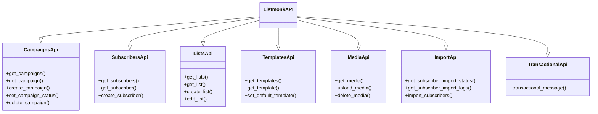

# Listmonk API & MCP Agent

[](https://pypi.org/project/listmonk-api/)

[](https://github.com/Knuckles-Team/listmonk-api/blob/main/LICENSE)

## Overview

Welcome to the `listmonk-api` developer documentation. This package provides:
1. **A Modular Python API Client** (`ListmonkAPI`) designed to interact with Listmonk's REST APIs.
2. **A Unified Model Context Protocol (MCP) Server** enabling any LLM-powered environment (like Windsurf, Claude Code, or Antigravity) to seamlessly manage lists, campaigns, subscribers, and templates.

Unlike traditional, flat wrappers, the modern `listmonk-api` codebase is built with a delegated subclassing architecture. The parent `ListmonkAPI` client aggregates dedicated sub-API managers. This design ensures separation of concerns, testability, and a lightweight context footprint.

---

## API Structure

The `ListmonkAPI` client subclasses modular sub-API clients to provide a single, unified interface for all endpoints:



### Supported API Modules

* **Subscribers**: Core CRUD, list subscriptions management, bulk subscriber imports.
* **Lists**: Subscriber lists creation, retrieval, updates, and styling.
* **Campaigns**: Creation, templating, previewing, execution tracking, and deletion.
* **Media**: Dynamic uploads, storage lookup, and asset deletion.
* **Templates**: HTML template storage, previewing, and defaults configuration.
* **Transactional Messaging**: High-performance one-off notification sends.

---

## MCP Tools Reference

Our MCP server exposes specialized tools to perform actions inside a Listmonk instance. All tools are tag-routed to allow granular permissions, policy controls, or sub-agent delegation.

### Available Tools

| Function Name | Description | Actions Supported | Tag(s) |
|---|---|---|---|
| `listmonk_subscribers` | Manage Listmonk subscribers operations. | `get_subscribers`, `get_subscriber`, `get_subscribers_from_list`, `create_subscriber` | `listmonk_subscribers` |
| `listmonk_lists` | Manage Listmonk lists operations. | `get_lists`, `get_list`, `create_list`, `edit_list` | `listmonk_lists` |
| `listmonk_imports` | Manage Listmonk subscriber imports. | `get_subscriber_import_status`, `get_subscriber_import_logs`, `import_subscribers`, `delete_subscriber_import` | `listmonk_imports` |
| `listmonk_campaigns` | Manage Listmonk marketing campaigns. | `get_campaigns`, `get_campaign`, `get_campaign_preview`, `get_campaign_stats`, `create_campaign`, `set_campaign_status`, `delete_campaign` | `listmonk_campaigns` |
| `listmonk_media` | Manage Listmonk media/image storage. | `get_media`, `upload_media`, `delete_media` | `listmonk_media` |
| `listmonk_templates` | Manage template layovers and defaults. | `get_templates`, `get_template`, `get_template_preview`, `set_default_template`, `delete_template` | `listmonk_templates` |
| `listmonk_tx` | Trigger transactional messaging. | `transactional_message` | `listmonk_tx` |

---

## Quick Start & Usage

### 1. API Client Example

Initialize the client with your credentials and call modular endpoints dynamically:

```python
from listmonk_api import ListmonkAPI

# Initialize client
client = ListmonkAPI(
    url="https://listmonk.yourdomain.com",
    token="your-secret-access-token"
)

# Fetch active lists
lists = client.get_lists()
for lst in lists:
    print(f"List: {lst.name} (ID: {lst.id})")

# Create a subscriber
new_subscriber = client.create_subscriber(
    email="user@domain.com",
    name="Jane Doe",
    status="enabled",
    lists=[1]
)
print(f"Created: {new_subscriber['name']}")
```

### 2. Launching the MCP Server

Start the MCP server using stdin/stdout transport:

```bash
listmonk-mcp --transport stdio
```

Alternatively, use environment variables to auto-initialize connection settings:

```bash
export LISTMONK_URL="https://listmonk.yourdomain.com"
export LISTMONK_TOKEN="your-secret-access-token"
listmonk-mcp --transport stdio
```
